# 🚀 DeanMachines VoltAgent AI System

<div align="center">

**🤖 Professional Multi-Agent AI System Built with VoltAgent & Google Gemini**

*A modular, production-ready AI agent orchestration platform featuring specialized sub-agents, MCP integration, and real-time collaboration capabilities.*

</div>

---

<div align="center">

[](https://voltagent.dev)
[](https://ai.google.dev)
[](https://typescriptlang.org)
[](https://nextjs.org)

[](https://github.com)
[](LICENSE)
[](https://nodejs.org)
[](CONTRIBUTING.md)

</div>

## 📋 Table of Contents

- [🎯 Overview](#-overview)
- [✨ Features](#-features)
- [🏗️ Architecture](#️-architecture)
- [🚀 Quick Start](#-quick-start)
- [📦 Installation](#-installation)
- [⚙️ Configuration](#️-configuration)
- [🤖 Agents](#-agents)
- [🛠️ Usage](#️-usage)
- [📚 API Documentation](#-api-documentation)
- [🔧 Development](#-development)
- [🧪 Testing](#-testing)
- [📈 Monitoring](#-monitoring)
- [🔒 Security](#-security)
- [🤝 Contributing](#-contributing)
- [📄 License](#-license)

## 🎯 Overview

DeanMachines VoltAgent is a cutting-edge AI agent orchestration system that leverages the power of Google's Gemini 2.5 Flash Lite models through the VoltAgent framework. Built with modern TypeScript and Next.js, it provides a robust foundation for creating, managing, and scaling AI-powered applications.

### 🎪 Live Demo
- **Backend API**: [http://localhost:3141](http://localhost:3141)
- **Swagger UI**: [http://localhost:3141/ui](http://localhost:3141/ui)
- **Frontend**: [http://localhost:3000](http://localhost:3000)
- **VoltOps Dashboard**: [https://console.voltagent.dev](https://console.voltagent.dev)

## ✨ Features

### 🧠 **Intelligent Agent System**
- **8 Specialized Sub-Agents** - Domain-specific AI agents for different tasks
- **Supervisor Orchestration** - Intelligent delegation and coordination
- **Memory & Context** - Persistent memory with advanced retrieval
- **MCP Integration** - Model Context Protocol for enhanced capabilities

### 🔧 **Technical Excellence**
- **Google Gemini 2.5** - Latest AI models with flash-lite performance
- **TypeScript First** - Full type safety and modern development
- **Modular Architecture** - Clean, maintainable, and scalable design
- **Production Ready** - Telemetry, monitoring, and error handling

### 🌐 **Integration Ready**
- **Next.js Frontend** - Modern React-based user interface
- **RESTful API** - Well-documented endpoints with Swagger
- **MCP Tools** - GitHub, GitLab, Brave Search, PostgreSQL, and more
- **Real-time Logging** - Comprehensive observability

## 🏗️ Architecture

```mermaid
graph TB
    A[👤 User] --> B[🌐 Next.js Frontend]
    A --> C[🔌 REST API]
    
    B --> C
    C --> D[🎯 Supervisor Agent]
    
    D --> E[📊 Math Agent]
    D --> F[📁 File Agent]
    D --> G[🌍 Web Agent]
    D --> H[⚡ Dev Agent]
    D --> I[📈 Data Agent]
    D --> J[💬 Comms Agent]
    D --> K[🧠 Memory Agent]
    
    E --> L[🤖 Google Gemini 2.5]
    F --> L
    G --> L
    H --> L
    I --> L
    J --> L
    K --> L
    
    M[🔧 MCP Tools] --> E
    M --> F
    M --> G
    M --> H
    M --> I
    M --> J
    M --> K
    
    N[💾 Memory Service] --> D
    O[🔍 Retriever Service] --> D
    P[📊 Telemetry] --> Q[☁️ VoltOps Cloud]
```



## 🚀 Quick Start

### Prerequisites
- **Node.js** 18.0.0 or higher
- **npm** or **yarn** package manager
- **Google AI API Key** ([Get one here](https://aistudio.google.com/app/apikey))
- **VoltAgent Account** ([Sign up here](https://console.voltagent.dev))

### 1-Minute Setup

```bash
# Clone the repository
git clone https://github.com/yourusername/deanmachines-volt.git
cd deanmachines-volt

# Install dependencies
npm install

# Set up environment variables
cp .env.example .env
# Edit .env with your API keys

# Start the development servers
npm run dev          # Full stack (Next.js + VoltAgent)
npm run dev:backend  # Backend only
npm run dev:frontend # Frontend only
```

## 📦 Installation

### Full Installation

```bash
# Clone and navigate
git clone https://github.com/yourusername/deanmachines-volt.git
cd deanmachines-volt

# Install all dependencies
npm install

# Build the project
npm run build
```

### Backend Only

```bash
# Install backend dependencies
npm install

# Run backend development server
npm run dev:voltagent
```

### Docker Setup

```bash
# Build and run with Docker
docker-compose up --build

# Or use individual services
docker-compose up voltagent  # Backend only
docker-compose up frontend   # Frontend only
```

## ⚙️ Configuration

### Environment Variables

Create a `.env` file in the root directory:

```env
# Google AI Configuration
GOOGLE_GENERATIVE_AI_API_KEY=your_google_ai_api_key_here

# VoltAgent Cloud (Optional)
PK=your_voltagent_public_key
SK=your_voltagent_secret_key

# MCP Services (Optional)
GITHUB_TOKEN=your_github_token
GITLAB_TOKEN=your_gitlab_token
BRAVE_API_KEY=your_brave_search_api_key
DATABASE_URL=your_postgresql_connection_string
GOOGLE_APPLICATION_CREDENTIALS=path/to/service-account.json
SLACK_BOT_TOKEN=your_slack_bot_token

# Application
NODE_ENV=development
PORT=3141
NEXT_PUBLIC_API_URL=http://localhost:3141
```

### Agent Configuration

Each agent can be customized through their respective configuration files:

```typescript
// voltagent/config/googleProvider.ts
export const googleProvider = createGoogleProvider({
  apiKey: process.env.GOOGLE_GENERATIVE_AI_API_KEY!,
  defaultModel: "gemini-2.5-flash-lite-preview-06-17",
  // Additional configuration...
});
```

## 🤖 Agents

### 🎯 Supervisor Agent
**Role**: Orchestrates and delegates tasks to specialized sub-agents
- **Capabilities**: Task routing, agent coordination, response synthesis
- **Model**: Gemini 2.5 Flash Lite
- **Tools**: All sub-agent capabilities

### 📊 Math Agent
**Role**: Mathematical computations and data analysis
- **Capabilities**: Calculations, statistical analysis, data visualization
- **Tools**: Calculator, chart generation, numerical analysis
- **Use Cases**: Financial modeling, scientific calculations

### 📁 File Agent
**Role**: File system operations and document management
- **Capabilities**: File CRUD, content analysis, format conversion
- **Tools**: Filesystem MCP, document parsers
- **Use Cases**: Document processing, file organization

### 🌍 Web Agent
**Role**: Web scraping and online research
- **Capabilities**: Web search, content extraction, API interactions
- **Tools**: Brave Search, web scraping, HTTP clients
- **Use Cases**: Research, data collection, monitoring

### ⚡ Dev Agent
**Role**: Software development assistance
- **Capabilities**: Code analysis, debugging, deployment
- **Tools**: GitHub/GitLab MCP, code analysis
- **Use Cases**: Code review, CI/CD, documentation

### 📈 Data Agent
**Role**: Database operations and data processing
- **Capabilities**: Query execution, data transformation, reporting
- **Tools**: PostgreSQL MCP, data visualization
- **Use Cases**: Analytics, reporting, data migration

### 💬 Comms Agent
**Role**: Communication and notification management
- **Capabilities**: Message sending, alert management, collaboration
- **Tools**: Slack MCP, email services
- **Use Cases**: Team collaboration, notifications

### 🧠 Memory Agent
**Role**: Knowledge management and retrieval
- **Capabilities**: Memory storage, context retrieval, knowledge graphs
- **Tools**: Vector databases, memory services
- **Use Cases**: Long-term memory, context management

## 🛠️ Usage

### Basic Agent Interaction

```typescript
import { VoltAgent } from '@voltagent/core';

// Initialize the system
const volt = new VoltAgent({
  agents: {
    supervisor: supervisorAgent,
    math: mathAgent,
    // ... other agents
  }
});

// Make a request
const response = await volt.invoke('supervisor', {
  message: "Calculate the ROI for a $10,000 investment with 8% annual return over 5 years"
});
```

### REST API Usage

```bash
# Health Check
curl http://localhost:3141/health

# Chat with Supervisor Agent
curl -X POST http://localhost:3141/agents/supervisor/chat \
  -H "Content-Type: application/json" \
  -d '{"message": "Help me analyze this data"}'

# Direct Agent Access
curl -X POST http://localhost:3141/agents/math/chat \
  -H "Content-Type: application/json" \
  -d '{"message": "Calculate compound interest for $1000 at 5% for 10 years"}'
```

### Frontend Integration

```typescript
// React component example
import { useState } from 'react';

export function ChatInterface() {
  const [message, setMessage] = useState('');
  const [response, setResponse] = useState('');

  const sendMessage = async () => {
    const res = await fetch('/api/chat', {
      method: 'POST',
      headers: { 'Content-Type': 'application/json' },
      body: JSON.stringify({ message, agent: 'supervisor' })
    });
    const data = await res.json();
    setResponse(data.response);
  };

  return (
    <div>
      <input 
        value={message} 
        onChange={(e) => setMessage(e.target.value)}
        placeholder="Ask the AI agents anything..."
      />
      <button onClick={sendMessage}>Send</button>
      <div>{response}</div>
    </div>
  );
}
```

## 📚 API Documentation

### Available Endpoints

| Method | Endpoint | Description |
|--------|----------|-------------|
| `GET` | `/health` | System health check |
| `GET` | `/agents` | List all available agents |
| `POST` | `/agents/{agentId}/chat` | Chat with specific agent |
| `GET` | `/agents/{agentId}/status` | Get agent status |
| `POST` | `/agents/supervisor/delegate` | Delegate task to best agent |
| `GET` | `/memory` | Retrieve stored memories |
| `POST` | `/memory` | Store new memory |
| `GET` | `/docs` | OpenAPI documentation |

### Response Format

All API responses follow this structure:

```typescript
interface ApiResponse<T> {
  success: boolean;
  data?: T;
  error?: string;
  timestamp: string;
  agent?: string;
  requestId: string;
}
```

## 🔧 Development

### Project Structure

```
deanmachines-volt/
├── app/                    # Next.js frontend application
│   ├── api/               # API routes
│   ├── components/        # React components
│   └── globals.css       # Global styles
├── voltagent/             # VoltAgent backend
│   ├── agents/           # Agent implementations
│   ├── config/           # Configuration files
│   ├── services/         # Core services
│   └── index.ts          # Main entry point
├── .env                   # Environment variables
├── package.json          # Dependencies and scripts
└── README.md             # This file
```

### Available Scripts

```bash
# Development
npm run dev              # Full stack development
npm run dev:backend      # Backend only (port 3141)
npm run dev:frontend     # Frontend only (port 3000)
npm run dev:voltagent    # VoltAgent only

# Building
npm run build            # Build everything
npm run build:frontend   # Build Next.js app
npm run build:backend    # Build VoltAgent

# Testing
npm test                 # Run all tests
npm run test:unit        # Unit tests only
npm run test:integration # Integration tests
npm run test:e2e         # End-to-end tests

# Linting & Formatting
npm run lint             # ESLint check
npm run lint:fix         # Fix linting issues
npm run format           # Prettier formatting
npm run type-check       # TypeScript checking

# Production
npm start                # Start production server
npm run preview          # Preview production build
```

### Development Guidelines

1. **Code Style**: Follow TypeScript best practices and use ESLint/Prettier
2. **Testing**: Write tests for all new features and bug fixes
3. **Documentation**: Update README and inline docs for API changes
4. **Git Flow**: Use feature branches and meaningful commit messages
5. **Performance**: Monitor agent response times and memory usage

## 🧪 Testing

### Running Tests

```bash
# All tests
npm test

# Specific test suites
npm run test:agents      # Test all agents
npm run test:services    # Test services
npm run test:api         # Test API endpoints

# Coverage report
npm run test:coverage
```

### Test Structure

```typescript
// Example agent test
describe('MathAgent', () => {
  let agent: MathAgent;

  beforeEach(() => {
    agent = new MathAgent();
  });

  it('should calculate compound interest correctly', async () => {
    const result = await agent.invoke({
      message: "Calculate compound interest for $1000 at 5% for 10 years"
    });
    
    expect(result).toContain('$1,628.89');
  });
});
```

## 📈 Monitoring

### Health Monitoring

The system includes comprehensive health monitoring:

- **Agent Health**: Each agent reports status and performance metrics
- **System Metrics**: Memory usage, response times, error rates
- **VoltOps Integration**: Cloud-based monitoring and analytics
- **Logging**: Structured logging with different levels

### Performance Metrics

```bash
# Check system health
curl http://localhost:3141/health

# Agent-specific metrics
curl http://localhost:3141/agents/supervisor/metrics

# Memory usage
curl http://localhost:3141/system/memory
```

### Telemetry

OpenTelemetry integration provides:
- Distributed tracing
- Performance monitoring
- Error tracking
- Custom metrics

## 🔒 Security

### Security Features

- **API Key Validation**: All external APIs require valid authentication
- **Input Sanitization**: All user inputs are validated and sanitized
- **Rate Limiting**: Prevent abuse with configurable rate limits
- **CORS Protection**: Properly configured cross-origin policies
- **Environment Isolation**: Sensitive data stored in environment variables

### Security Best Practices

1. **Never commit API keys** to version control
2. **Use environment variables** for all sensitive configuration
3. **Regular dependency updates** to patch security vulnerabilities
4. **Monitor logs** for suspicious activity
5. **Implement proper error handling** to avoid information leakage

### Reporting Security Issues

If you discover a security vulnerability, please:
1. **Do not** create a public GitHub issue
2. Email security concerns to: security@deanmachines.dev
3. Include detailed information about the vulnerability
4. Allow time for assessment and patching before disclosure

## 🤝 Contributing

We welcome contributions! Please see our [Contributing Guide](CONTRIBUTING.md) for details.

### Quick Contribution Guide

1. **Fork** the repository
2. **Create** a feature branch (`git checkout -b feature/amazing-feature`)
3. **Make** your changes with tests
4. **Commit** with clear messages (`git commit -m 'Add amazing feature'`)
5. **Push** to your branch (`git push origin feature/amazing-feature`)
6. **Open** a Pull Request

### Development Setup

```bash
# Fork and clone your fork
git clone https://github.com/yourusername/deanmachines-volt.git
cd deanmachines-volt

# Add upstream remote
git remote add upstream https://github.com/original/deanmachines-volt.git

# Install dependencies
npm install

# Create feature branch
git checkout -b feature/your-feature-name

# Make changes, test, and commit
npm test
git add .
git commit -m "feat: add your feature"

# Push and create PR
git push origin feature/your-feature-name
```

## 📞 Support & Community

- **📚 Documentation**: [Full documentation](https://docs.deanmachines.dev)
- **💬 Discord**: [Join our community](https://discord.gg/deanmachines)
- **🐛 Issues**: [Report bugs](https://github.com/yourusername/deanmachines-volt/issues)
- **💡 Feature Requests**: [Request features](https://github.com/yourusername/deanmachines-volt/discussions)
- **📧 Email**: support@deanmachines.dev

## 🙏 Acknowledgments

- **[VoltAgent](https://voltagent.dev)** - The amazing framework that powers this system
- **[Google AI](https://ai.google.dev)** - Gemini models for intelligent processing
- **[Vercel](https://vercel.com)** - AI SDK and deployment platform
- **[Next.js](https://nextjs.org)** - React framework for the frontend
- **[TypeScript](https://typescriptlang.org)** - Type-safe development

## 📄 License

This project is licensed under the MIT License - see the [LICENSE](LICENSE) file for details.

---

<div align="center">

**⭐ If you found this project helpful, please give it a star! ⭐**

Made with ❤️ by [DeanMachines](https://github.com/yourusername)

[🚀 Get Started](#-quick-start) • [📚 Documentation](https://docs.deanmachines.dev) • [💬 Community](https://discord.gg/deanmachines)

</div>
